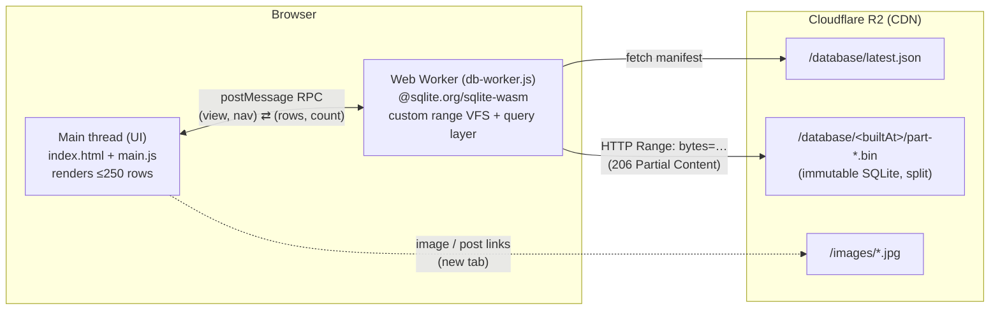

# fb-politika-archivum

[](https://github.com/ferenci-tamas/fb-politika-archivum/actions/workflows/deploy.yml)

Magyar politikai és közéleti Facebook-posztok archívuma, 2008–2026.

A zero-backend, fully static web application for searching, filtering and browsing
a read-only archive of ~650,000 Hungarian political Facebook posts. The entire
database is a single immutable SQLite file hosted on Cloudflare R2; the browser
queries it **directly** over HTTP range requests using
[`@sqlite.org/sqlite-wasm`](https://sqlite.org/wasm), inside a Web Worker. There
is no application server.

- **Live site:** https://ferenci-tamas.github.io/fb-politika-archivum/
- **Data + images:** https://fb-politika-archivum.medstat.hu (Cloudflare R2)
- **Posts:** 654,375 · **Authors:** 106 · **DB size:** ~686 MB (SQLite, page size 16384)

## Usage

Open the [live site](https://ferenci-tamas.github.io/fb-politika-archivum/) — no login, nothing to install; everything runs in your browser.

- **Search** — type in the search box; results update as you type. Multiple words are AND-combined (`hiány növekedés` → posts with both). Use quotes for a phrase (`"védett ár"`), a trailing `*` for a prefix (`megszorít*`), `OR` between words (`Ukrajna OR ukrán`), and a leading `-` to exclude (`kormány -brüsszel`). Search is accent-insensitive by default — tick **Ékezetérzékeny** to match diacritics exactly; the **×** clears it.
- **Filter** — select one or more **authors** (type to filter the list; chosen authors appear as chips and are combined with OR) and/or a **date range**. **Szűrők törlése** resets everything.
- **Sort** — newest first, oldest first, or by author (A→Z).
- **Browse** — choose 50 / 100 / 250 rows per page and move with **Legújabb / Újabb / Régebbi / Legrégebbi** (first / newer / older / last). Long posts expand with **Megnyitás / Kevesebb**. In each row, **Poszt** opens the original Facebook post, and the numbered **Linkek** (green ✓ = reachable, red ✕ = not) and **Képek** open in a new tab.

Search, filters and sorting combine freely, and the footer shows how little of the database your session downloaded.

Your current search and filters are reflected in the page URL (after `#`), so you can bookmark or share a link to any view — it reopens on the first page. Authors are encoded by name, so links stay valid across archive rebuilds.

---

## Table of contents

- [Usage](#usage)

1. [Architecture](#1-architecture)
2. [SQLite schema](#2-sqlite-schema)
3. [Build the frontend locally](#3-build-the-frontend-locally)
4. [Run the website locally](#4-run-the-website-locally)
5. [Configure Cloudflare R2](#5-configure-cloudflare-r2)
6. [Configure R2 CORS](#6-configure-r2-cors)
7. [Deploy to GitHub Pages](#7-deploy-to-github-pages)
8. [How the browser accesses SQLite](#8-how-the-browser-accesses-sqlite)
9. [How HTTP range requests are used](#9-how-http-range-requests-are-used)
10. [Reproduce / validate the production build](#10-reproduce--validate-the-production-build)
11. [Database size & performance characteristics](#11-database-size--performance-characteristics)
12. [Security model](#security-model)
13. [Project layout](#project-layout)

---

## 1. Architecture

No runtime backend exists. GitHub Pages serves only static assets (HTML, CSS, JS,
and the SQLite `.wasm`). All SQLite work — initialization, the custom VFS, the
synchronous network reads, and SQL execution — happens inside a dedicated **Web
Worker**, so the UI thread never blocks.



Key decisions:

- **Everything is read-only and immutable.** No editing, deletion, insertion or
  sync. The file reports `SQLITE_IOCAP_IMMUTABLE` and is opened read-only, so
  SQLite skips all locking and journal/WAL probing.
- **Only the current page is ever materialized.** Queries return at most
  `pageSize` (50/100/250) rows; the DOM never holds more than a few hundred `<tr>`.
- **Keyset (cursor) pagination** for the chronological feed and all filtered
  views, so deep navigation is constant-time (no growing `OFFSET`). Because
  `posts.id` is assigned in `(time, postId)` order, the id doubles as a stable
  time-ordered cursor. There are therefore no arbitrary page-number jumps (which
  would require `OFFSET`); navigation is First / Prev / Next / Last.
- **Single source of SQL.** All statements live in `src/lib/queries.js` and use
  bound parameters (`?`) exclusively.

### Request → render flow

1. `main.js` sends `{ view, nav, wantCount }` to the worker.
2. The worker resolves date filters to rowid bounds, runs the keyset query
   (choosing the index path that avoids a sort), hydrates the page rows
   (embedded images/links JSON included — no join), and returns structured rows.
3. `main.js` renders the rows with `textContent` and validated links; stale
   responses (superseded by a newer request id) are dropped.

## 2. SQLite schema

The database is produced by [`SQLite-converter.R`](SQLite-converter.R) (schema
version 2). Summary:

| Table | Columns | Notes |
|---|---|---|
| `posts` | `id INTEGER PRIMARY KEY`, `postId TEXT`, `authorId INTEGER`, `url TEXT`, `time INTEGER`, `text TEXT`, `images TEXT`, `links TEXT` | `id` is 1..N in `(time, postId)` order. `images` = JSON `["name", …]`; `links` = JSON `[["url", 0\|1], …]`; both `NULL` when empty. |
| `links` | `id`, `postId`, `link`, `available` | Normalized 1:N; `id` clustered in the post's rowid range. |
| `images` | `id`, `postId`, `filename` | Normalized 1:N; clustered likewise. |
| `authors` | `authorId`, `authorname`, `post_count`, `first_time`, `last_time` | 106 rows, `authorId` in Hungarian alphabetical order; precomputed stats. |
| `archive_meta` | `key`, `value` | `post_count`, `min_id`/`max_id`, `min_time`/`max_time`, strides, `schema_version`, … |

Indexes: `idx_posts_postId` (unique), `idx_posts_time`, `idx_posts_author_time
(authorId DESC, time)`, `idx_images_postId`, `idx_links_postId`.

Full-text (FTS5, external content over `posts.text`, `content_rowid = id`):

- **`posts_fts`** — `unicode61 remove_diacritics 0` (diacritic-sensitive: `kör ≠ kor`).
- **`posts_fts_folded`** — `unicode61 remove_diacritics 2` (diacritic-insensitive and case-folding, including non-ASCII: `kör = kor = kór`, `Ő = ő`).

The app searches `posts_fts_folded` by default (forgiving for Hungarian input) and
switches to `posts_fts` when the **Ékezetérzékeny** (accent-sensitive) toggle is
on.

The `images`/`links` are also embedded as JSON in `posts`, so a page of results is
hydrated with **one** query against `posts` alone — no 1:N joins, and no extra
database pages fetched to attach children.

## 3. Build the frontend locally

Requirements: Node.js ≥ 20.19 (or ≥ 22.12) and npm.

```bash
npm install
npm run build      # outputs static site to dist/
```

The R2 base URL comes from the build-time variable `VITE_R2_BASE_URL` (see
[`.env`](.env)). It is a **public** endpoint, not a secret.

## 4. Run the website locally

```bash
npm run dev        # Vite dev server, http://localhost:5173
# or preview a production build:
npm run build && npm run preview   # http://localhost:4173
```

The local page still reads the live database from R2, so the R2 CORS policy must
allow your localhost origin. The committed [`r2-cors.json`](r2-cors.json) is
production-only (just the GitHub Pages origin), so for local development add your
dev origin (e.g. `http://localhost:5173`) to `AllowedOrigins` and apply it (see §6).

Run the tests:

```bash
npm test                     # unit tests + (if the local DB is present) the full e2e
R2_LIVE_TEST=1 npm test      # additionally hits the live R2 endpoint
```

## 5. Configure Cloudflare R2

The bucket is served at a custom domain (`fb-politika-archivum.medstat.hu`) and
contains two prefixes:

```
/database/latest.json                     # pointer + manifest (short cache)
/database/<builtAt>/manifest.json         # per-build manifest
/database/<builtAt>/part-000.bin          # SQLite bytes [0, partSize)
/database/<builtAt>/part-001.bin          # SQLite bytes [partSize, …)
/images/<filename>                        # post images
```

### Manifest format

`latest.json` and each build's `manifest.json` share one JSON object whose shape is
versioned by `MANIFEST_FORMAT` (currently **2**). It is versioned independently of
the SQLite `schema_version` because it describes how the archive is *split*, not
what is in it. Clients treat unknown fields as optional.

| Field | Meaning |
|---|---|
| `format` | Manifest format version (`2`). |
| `schemaVersion` | The archive's `schema_version` (`2`), so a client can reject an archive it cannot read before fetching any data. |
| `builtAt` | Build id; also the folder name under `/database/`. |
| `file` | Archive filename (for tooling that reassembles the parts). |
| `size`, `md5` | Byte size and MD5 of the whole archive. |
| `pageSize` | SQLite page size (`16384`). |
| `partSize` | Bytes per part (all but the last). |
| `monthBounds` | *(format 2+)* Array of `{ ym, lo }` — the smallest `id` in each `YYYY-MM`. Because `id` is assigned in `(time, postId)` order, these partition the archive by month exactly, so the **Elemzés** tab buckets search hits per month without scanning the time index in the browser. |
| `parts` | Array of `{ name, offset, size, md5 }` — consecutive, page-aligned byte ranges that concatenate to the archive. |
| `base` | *(`latest.json` only)* The build folder relative to `latest.json` (trailing slash), so a client resolves part names against it. |

`monthBounds` is **optional**: against an older format-1 manifest (no such field),
the worker falls back to computing the boundaries with a one-time covering-index
scan of `idx_posts_time` — correct, just slower on the first search of a session.

The archive is split into page-aligned **parts** because Cloudflare only edge-caches
objects ≤ 512 MB; each part is 384 MiB. `SQLite-converter.R` (section 15) writes the
parts, `manifest.json`, and `latest.json`, and prints the exact `rclone` upload
commands. Upload the build folder first and `latest.json` last, with caching:

```bash
# Immutable data (1 year):
rclone copy -P archive-parts/<builtAt> r2:<bucket>/database/<builtAt> \
  --header-upload "Cache-Control: public, max-age=31536000, immutable" \
  --s3-upload-cutoff 1G --s3-no-check-bucket
# Pointer (short cache so new builds are picked up within ~a minute):
rclone copyto -P archive-parts/latest.json r2:<bucket>/database/latest.json \
  --header-upload "Cache-Control: public, max-age=60" --s3-no-check-bucket
```

Images should be uploaded under `/images/` (long cache is fine; they are immutable).

To host the data elsewhere, set `VITE_R2_BASE_URL` to the new origin and rebuild.

## 6. Configure R2 CORS

CORS is required so the browser may issue cross-origin **range** requests and read
the `Content-Range` response header. The policy is in [`r2-cors.json`](r2-cors.json):

- `AllowedOrigins`: the GitHub Pages site only (add a localhost origin for local dev)
- `AllowedMethods`: `GET`, `HEAD`
- `AllowedHeaders`: `Range`
- `ExposeHeaders`: `Content-Range`, `Content-Length`, `Accept-Ranges`, `ETag`
- `MaxAgeSeconds`: `86400`

It is **not** `*` — only the specific origins needed.

Apply it with one of:

- **Dashboard:** R2 → your bucket → *Settings* → *CORS Policy* → *Edit* → paste the
  contents of `r2-cors.json`.
- **Wrangler:** `npx wrangler r2 bucket cors set <bucket> --file r2-cors.json`
- **AWS CLI (S3 API):** wrap the rules in `{ "CORSRules": [ … ] }` and run
  `aws s3api put-bucket-cors --bucket <bucket> --cors-configuration file://cors.json
  --endpoint-url https://<accountid>.r2.cloudflarestorage.com`

Verify from a shell (expect `206`, a `content-range` header, and
`access-control-allow-origin`):

```bash
curl -sD - -o /dev/null -H "Origin: https://ferenci-tamas.github.io" \
  -H "Range: bytes=0-99" \
  https://fb-politika-archivum.medstat.hu/database/latest.json
```

## 7. Deploy to GitHub Pages

Deployment is automated by [`.github/workflows/deploy.yml`](.github/workflows/deploy.yml):

1. In the repository: **Settings → Pages → Build and deployment → Source = GitHub
   Actions**.
2. Push to `main`. The workflow runs `npm ci`, `npm test`, `npm run build`, and
   publishes `dist/` to Pages.

The site is served under the project sub-path `/fb-politika-archivum/`; Vite's
`base` (in [`vite.config.js`](vite.config.js)) makes every asset URL — including the
worker and the `.wasm` — resolve correctly under it. A `public/.nojekyll` file
disables Jekyll processing.

## 8. How the browser accesses SQLite

- The worker fetches `latest.json`, then calls `sqlite3InitModule()` from
  `@sqlite.org/sqlite-wasm`.
- It installs a **custom read-only VFS** ([`src/lib/http-vfs.js`](src/lib/http-vfs.js))
  via `sqlite3.vfs.installVfs(...)`. The VFS's `xRead` serves pages from an
  in-worker LRU block cache, which on a miss calls a synchronous reader.
- The database is opened read-only on that VFS:
  `new sqlite3.oo1.DB('/archive.sqlite', 'r', 'http-range')`, with
  `PRAGMA temp_store=MEMORY` and a ~16 MB page cache.
- No OPFS, no SharedArrayBuffer, no Atomics — so the app needs **no** COOP/COEP
  headers (which GitHub Pages cannot set). The custom VFS uses synchronous XHR
  instead, which is allowed inside a Worker.

## 9. How HTTP range requests are used

- SQLite asks the VFS for specific byte ranges (a 100-byte header read, then
  16384-byte page reads). The VFS rounds each read out to 32 KiB blocks and fetches
  only the missing blocks.
- The synchronous reader ([`src/worker/transport-xhr.js`](src/worker/transport-xhr.js))
  issues `GET` with a `Range: bytes=START-END` header. A `PartMap`
  ([`src/lib/parts.js`](src/lib/parts.js)) maps each absolute range to the correct
  part file (splitting across the boundary when necessary).
- Responses **must** be `206 Partial Content`. If the server returns `200 OK`
  (range ignored), the reader throws and the UI shows a clear error rather than
  silently downloading the whole object.
- On open, the first 256 KiB is prefetched in one request (the b-tree roots,
  `archive_meta`, and `sqlite_stat*` live there thanks to `VACUUM INTO`), so
  opening the database and reading metadata needs a single round-trip.
- Blocks are cached for the session; the data is immutable, and R2 serves it with
  `Cache-Control: public, max-age=31536000, immutable`, so repeat visits are fast.

## 10. Reproduce / validate the production build

The database is produced by `SQLite-converter.R` from `toconvert.rds`; it writes
`archive.sqlite`, the `archive-parts/<builtAt>/` folder, and `latest.json`, running
an extensive battery of self-checks (row counts, FTS integrity, keyset-vs-OFFSET
equivalence, clustered child ranges, etc.).

To validate the published data and this frontend against it:

```bash
# 1. Reconstruct the single file from the published parts (optional, for tooling):
cat 1790843311/part-000.bin 1790843311/part-001.bin > archive.sqlite
#   (Windows: copy /b part-000.bin + part-001.bin archive.sqlite)

# 2. Run the test suite. With the parts present under <builtAt>/, the e2e test
#    opens the REAL database through the custom VFS (file-backed reader) and
#    checks metadata, keyset == OFFSET, search/filter/sort, and that it never
#    reads more than a few MB:
npm test

# 3. Verify the deployed endpoint actually serves ranges byte-for-byte:
R2_LIVE_TEST=1 npm test
```

`npm run build` is deterministic given the committed sources and `.env`.

## 11. Database size & performance characteristics

- **Size:** ~686 MB, page size 16384 (set by the converter's `PAGE_SIZE`), split
  into 2 parts (384 MiB + ~302 MiB). 654,375 posts, 131,652 links, 602,009 images, 106 authors.
- **Startup:** one `latest.json` fetch + one 256 KiB prefetch. The full database is
  never downloaded.
- **Per interaction:** a page of 50 typically costs a handful of range requests
  (sub-MB). Exercising *every* feature (feed, deep keyset walk, author filter,
  date range, folded & sensitive search, phrase search, search+author,
  author sort, oldest page) in the e2e test fetches **< 20 MB total**.
- **Query plans** (validated with `EXPLAIN QUERY PLAN` on the full dataset) avoid
  `TEMP B-TREE` sorts:
  - feed / keyset → integer-primary-key range (constant time);
  - date range → covering `idx_posts_time`;
  - author filter / author sort → covering `idx_posts_author_time` (the hint
    forces the author equality to drive, turning a full-text match into a bloom
    filter instead of tens of thousands of scattered row probes);
  - search without an author → the FTS index itself provides rowid (time) order.
- **Counts** are cheap in every combination: no filter → `archive_meta`; author →
  precomputed `authors.post_count`; date → rowid-window width; search → FTS doclist
  count (~1 ms).
- **Concurrency:** entirely client-side and read-only, so there is no per-user
  server state and any number of users are independent.

## Security model

- All post text and author names are rendered with `textContent` only — never
  `innerHTML`. There is no HTML/JS execution from database content.
- Every external URL (post, link, image) is validated to be absolute `http(s)`
  before becoming a link; `javascript:`, `data:`, `vbscript:`, `file:`, `mailto:`,
  relative and malformed URLs are rejected. Image filenames are
  `encodeURIComponent`-encoded to prevent path traversal.
- Every external link uses `target="_blank"` and `rel="noopener noreferrer"`.
- Link availability is shown by a ✓/✕ glyph **plus** `title`/`aria-label`, not by
  color alone.
- All SQL uses bound parameters (`?`); user input (including the FTS query) is
  never concatenated into SQL. Free-form search text is turned into a syntactically
  safe FTS5 expression by [`src/lib/fts-query.js`](src/lib/fts-query.js).
- No secrets are in the repository or client code; `VITE_R2_BASE_URL` is a public
  read-only CDN endpoint.

## Project layout

```
index.html                     App shell (controls, table, pager, loading overlay)
src/
  main.js                      UI controller: state, worker RPC, events, states
  config.js                    Build-time config (R2 URLs from VITE_R2_BASE_URL)
  styles.css                   Responsive, accessible styling
  worker/
    db-worker.js               Web Worker: sqlite init, VFS install, query RPC
    transport-xhr.js           Synchronous HTTP range reader (206 handling)
  lib/
    http-vfs.js                Read-only range VFS + LRU block cache
    parts.js                   Absolute range → part slices mapping
    queries.js                 All SQL (keyset, FTS, filters, sort, hydrate)
    fts-query.js               Safe FTS5 query builder
    sanitize.js                URL validation + embedded JSON parsing
    format.js                  Hungarian date formatting + date↔UNIX
    constants.js               Shared constants / VFS tuning
  ui/
    render.js                  Safe table-row rendering
    dom.js                     DOM helpers + validated external anchors
tests/                         node:test unit + e2e + live-range tests
r2-cors.json                   R2 CORS policy
.github/workflows/deploy.yml   GitHub Pages CI/CD
SQLite-converter.R             Builds the SQLite archive + parts + manifest
```

## License

MIT — see [LICENSE](LICENSE).
